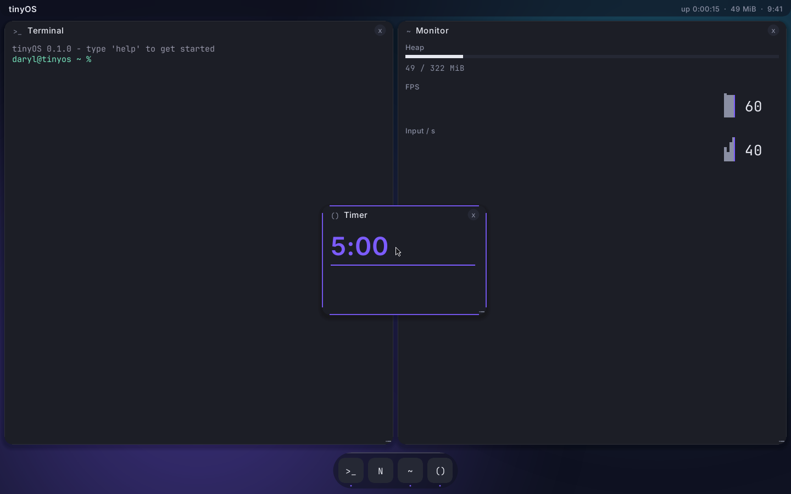
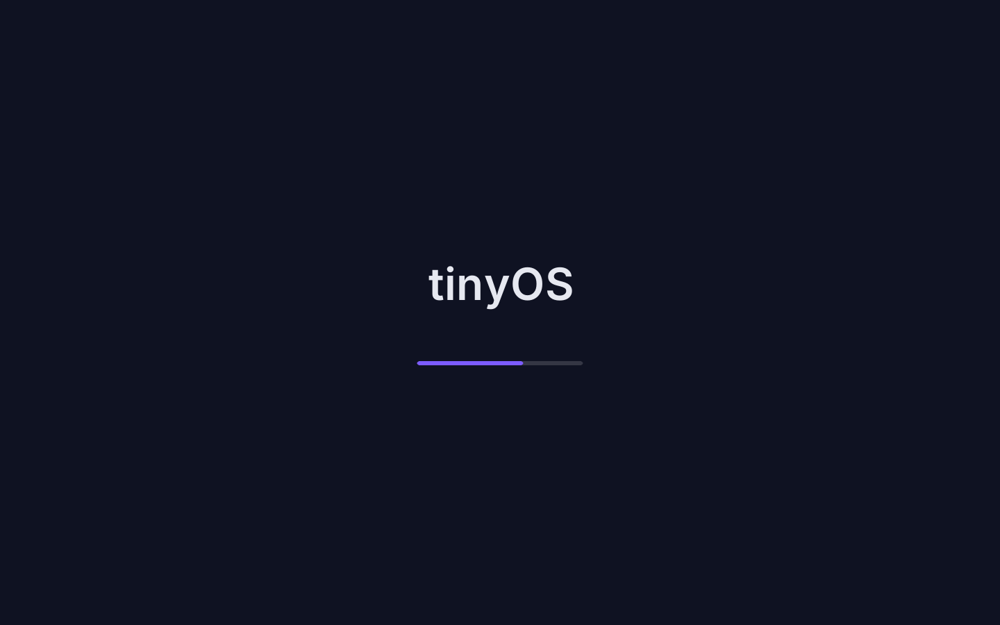
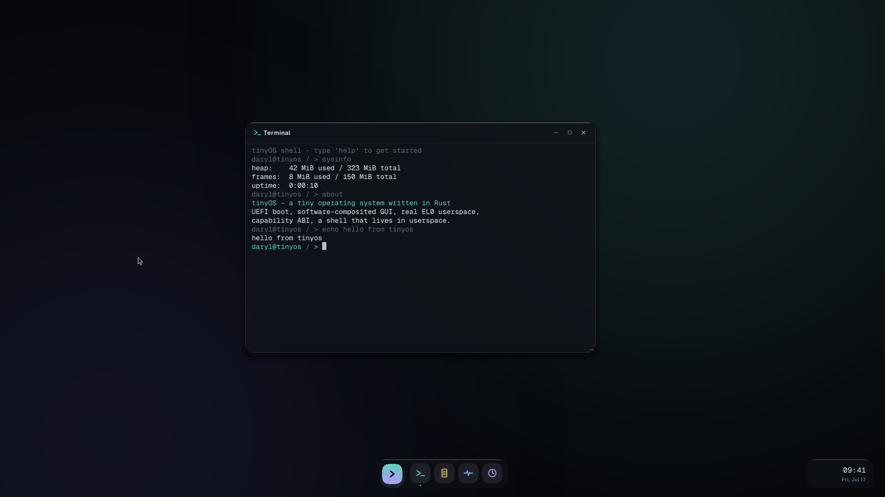

# tinyOS

A tiny operating system written in Rust for arm64 and x86_64: UEFI boot, a
software-composited GUI (Meridian design), real userspace processes at EL0
behind a capability-based syscall ABI, a copy-on-write filesystem, and a
terminal that hosts full-screen text apps — no POSIX, no escape sequences,
no problems.



## What it does

- Boots as a UEFI application on QEMU — arm64 `virt` (HVF-accelerated on
  Apple Silicon, the fast dev loop) or x86_64 `q35` (TCG-emulated) — grabs
  the GOP framebuffer, exits boot services, and runs freestanding.
- Animated boot splash → desktop with procedural "aurora" wallpaper, frosted
  Meridian shell (dock, Ctrl+K command palette), draggable windows with
  macOS-style chrome.
- **Real userspace (arm64):** apps are static ELF binaries running at EL0 in
  per-process TTBR1 address spaces (ASID-tagged, flush-free switches),
  talking to the kernel through a ~16-syscall capability ABI — handles +
  rights, channels carrying bytes + handles, shared-memory objects, one
  unified wait. Timer-preempted, memory-quota'd (64 MiB/process), spawnable
  from userspace with explicit capability grants.
- **Everything else is a protocol over channels**, so the kernel stays
  small: the console protocol (line stdin, full-screen cell surfaces for
  vim-class TUIs, an Ink-style bottom live region), the window protocol
  (zero-copy BGRA surfaces), the file protocol, and a narrow process-control
  protocol. All defined once in `crates/abi`, shared by kernel and SDK.
- **The apps live in userspace**: vi (a real modal editor on the host-tested
  `vicore` engine), a windowed text editor/notes, solitaire, a `view` pager,
  `top`, clock, and demo TUIs — launched from the terminal (`run <name>`,
  `&` for background jobs) or the palette/dock.
- **tinyfs**, a native copy-on-write filesystem on virtio-blk: shadow-paging
  checkpoints (crash-consistent by construction — the test suite replays
  every write-log cut point), files persist across reboots in `disk.img`.
  Host-side `mkfs-tinyfs` tool; `make sync-apps` updates `/apps` in place
  without touching user files.
- Interrupt-driven and tickless: GICv3 (arm64) / LAPIC+IOAPIC (x86_64),
  one-shot timers, idle CPUs in wfi/hlt at ~0 host CPU. Cooperative SMP
  scheduler on 4 cores, a bitmap frame allocator over the UEFI memory map,
  canary-checked kernel stacks.
- Shell built-ins: files (`ls cat write append touch mkdir rm mv cp cd pwd
  fsinfo`), processes (`ps kill jobs run`), editors (`vi`, `edit` — both
  userspace), system (`sysinfo memstat uptime date spin about`), and
  `shutdown` / `reboot` (sync the disk, then power off).

| | |
|---|---|
|  |  |

## Running it (macOS, Apple Silicon)

```sh
brew install qemu     # once
make run              # arm64, near-native under HVF
make run ARCH=x86_64  # x86_64, emulated (no userspace yet on this arch)
```

`make run` builds the kernel for `aarch64-unknown-uefi`, stages it as
`esp/EFI/BOOT/BOOTAA64.EFI`, and boots QEMU with edk2 firmware under
Hypervisor.framework. Serial output lands on stdout. If HVF gives you
trouble: `make run ACCEL="-accel tcg -cpu cortex-a72"`.

After changing an app: `make sync-apps` refreshes `/apps` inside the disk
image in place (user files survive). `make test` runs the host-side suites
(tinyfs crash consistency, textui, vicore, solitaire) and checks both
kernel targets compile.

`make smoke` boots the OS headless and drives the real userspace shell over
QEMU's QMP channel — typing `help`, `ls`, `ps`, launching a full-screen app
and killing it with Ctrl+C, then `shutdown` — asserting on command output
mirrored to serial. It catches the whole class of multi-core / IPC / console
back-pressure bugs that only surface at runtime and are invisible to the host
suites. See `tools/smoke/`.

The desktop runs at 1440×900 by default (the kernel re-points QEMU's ramfb
at its own framebuffer via fw_cfg, past edk2's 1024×768 GOP ceiling). Pick
any size with `make run RES=1920x1200`.

## Layout

```
crates/
  abi/           the ABI, defined once: syscalls, protocols, design tokens
  textui/        cell-grid TUI toolkit (host-tested)
  tinyfs/        the filesystem: no_std core, host-testable
  vicore/        the vi engine: pure, host-tested
kernel/src/
  main.rs        UEFI entry, boot handoff, UI thread
  sched/         cooperative SMP scheduler: threads, ready/wait queues
  arch/          aarch64 (EL0 userspace, GICv3, PSCI) + x86_64 backends
  mem/           heap + bitmap frame allocator over the UEFI memory map
  obj/           capability layer: handles, channels, memobjs, processes,
                 syscalls, ELF loader, process-control service
  drivers/       PCI ECAM, virtio-pci, virtio-input, virtio-blk
  fs/            mounted-fs singleton + the file-protocol service
  gfx/ ui/ term/ compositor, Meridian shell, terminal emulator
apps/            the userspace workspace: sdk/ (tinyos-app runtime) + apps
tools/mkfs-tinyfs/  host tool: create/populate/update/inspect disk images
docs/superpowers/   design specs + roadmap (start: 2026-07-19-roadmap.md)
```

Fonts: [Geist and Geist Mono](https://vercel.com/font), OFL (license in
`assets/`). Inspired by [Philipp Oppermann's blog_os](https://os.phil-opp.com).
